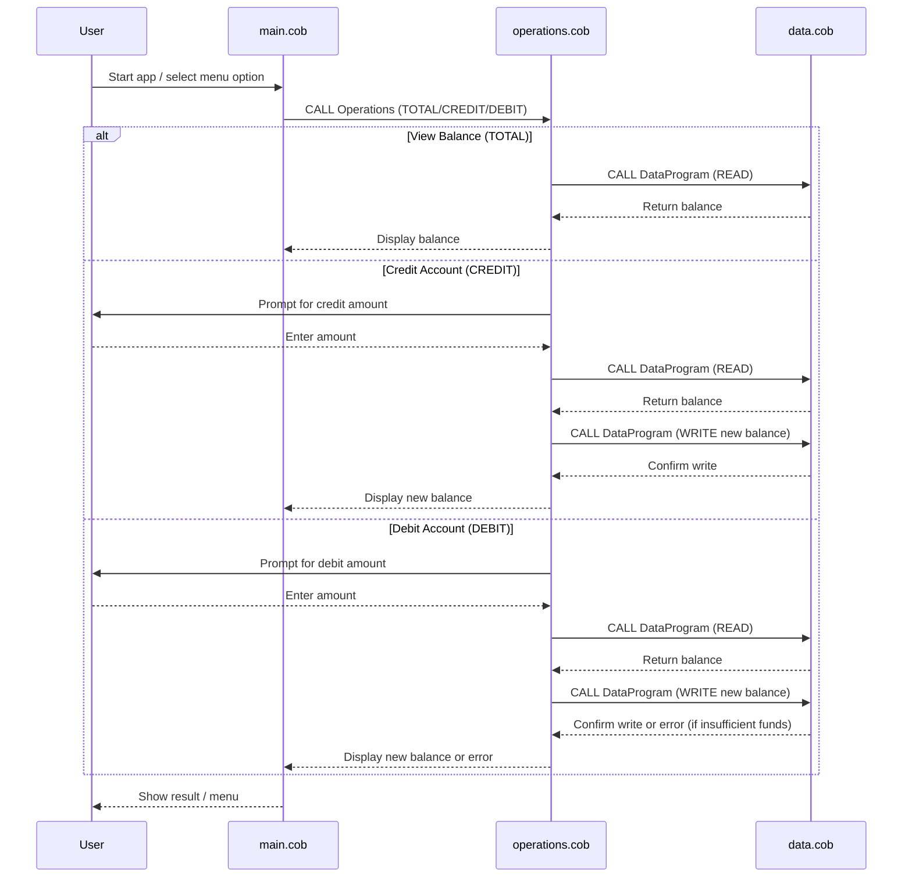

# COBOL Student Account Management System

This project demonstrates a simple legacy COBOL application for managing student accounts. The system allows users to view balances, credit, and debit student accounts, simulating basic banking operations. The code is organized into three main COBOL files, each with a specific responsibility.

## COBOL File Overview

### 1. `main.cob`
**Purpose:**
- Acts as the entry point and user interface for the application.
- Presents a menu to the user for account operations: view balance, credit, debit, or exit.
- Handles user input and delegates business logic to the `operations.cob` module.

**Key Functions:**
- Displays the main menu and processes user choices.
- Calls the `Operations` program with the appropriate operation type (`TOTAL`, `CREDIT`, `DEBIT`).

**Business Rules:**
- Only allows valid menu choices (1-4).
- Exits cleanly when the user selects the exit option.

---

### 2. `operations.cob`
**Purpose:**
- Implements the core business logic for account operations.
- Handles crediting, debiting, and displaying the account balance.

**Key Functions:**
- Receives the operation type from `main.cob`.
- For `TOTAL`: Calls `DataProgram` to read and display the current balance.
- For `CREDIT`: Prompts for an amount, reads the current balance, adds the amount, writes the new balance, and displays it.
- For `DEBIT`: Prompts for an amount, checks if sufficient funds exist, subtracts the amount if possible, writes the new balance, and displays it. If insufficient funds, displays an error message.

**Business Rules:**
- Prevents debiting more than the available balance (no overdraft allowed).
- All balance updates are persisted via the `DataProgram`.

---

### 3. `data.cob`
**Purpose:**
- Manages persistent storage of the account balance.
- Provides read and write operations for the balance.

**Key Functions:**
- For `READ`: Returns the current stored balance.
- For `WRITE`: Updates the stored balance with a new value.

**Business Rules:**
- All balance changes must go through this module to ensure data consistency.
- Initial balance is set to 1000.00.

---

## Business Rules Summary
- Only valid menu options are accepted.
- Credit and debit operations require user input for the amount.
- Debit operations are only allowed if sufficient funds are available.
- All balance changes are managed centrally in `data.cob` for consistency.

---

---

## Sequence Diagram: Data Flow

For more details, see the source code in `/src/cobol/`.
